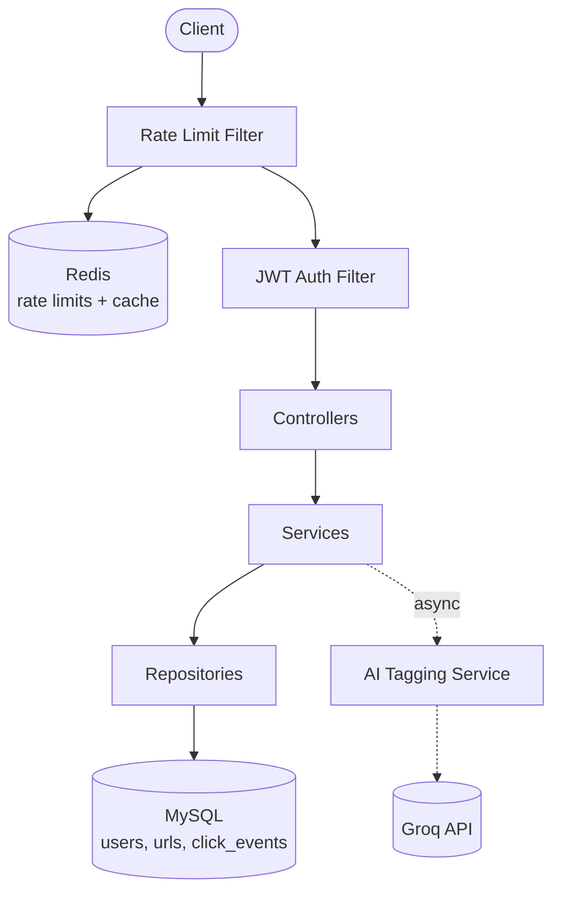

# 🔗 URL Shortener — Spring Boot Backend

A production-style URL shortening service built with Spring Boot, featuring Redis caching, JWT authentication, rate limiting, AI-powered categorization, and full Docker containerization with CI/CD.


---

## 📋 Table of Contents

- [Overview](#overview)
- [Features](#features)
- [Tech Stack](#tech-stack)
- [Architecture](#architecture)
- [Getting Started](#getting-started)
- [API Reference](#api-reference)
- [Key Design Decisions](#key-design-decisions)
- [Running Tests](#running-tests)
- [What's Next](#whats-next)

---

## Overview

This isn't a tutorial-style URL shortener — it's built to demonstrate real backend engineering concerns: cache invalidation strategy, race-condition-safe concurrency, stateless authentication design, async processing, and CI/CD automation. Every feature below was built with a specific production trade-off in mind, documented in [Key Design Decisions](#key-design-decisions).

## Features

| Feature | Description |
|---|---|
| 🔗 **URL Shortening** | Base62 encoding derived from database auto-increment IDs — compact, collision-free short codes |
| ⚡ **Redis Caching** | Cache-aside pattern with TTL-based expiry on the redirect lookup path |
| 🛡️ **Rate Limiting** | Atomic Redis counters (token-bucket style), per-IP |
| 🔐 **JWT Authentication** | Registration, login, BCrypt password hashing, fully stateless token validation |
| 📊 **Atomic Click Tracking** | Race-condition-safe click counting via a single atomic SQL update |
| 🤖 **AI Auto-Categorization** | Async LLM call (Groq API) tags each URL with a category — never blocks the request path |
| 🗄️ **Flyway Migrations** | Versioned, repeatable database schema — no manual DDL |
| 🐳 **Dockerized** | Full stack (app + MySQL + Redis) runs with a single command |
| ✅ **CI/CD Pipeline** | GitHub Actions runs the full test suite and builds the Docker image on every push |
| 🧪 **Unit Tested** | Service-layer logic tested in isolation with JUnit 5 + Mockito |

## Tech Stack

- **Backend:** Java 21, Spring Boot 3.3, Spring Security, Spring Data JPA
- **Database:** MySQL 8, Flyway migrations
- **Caching / Rate Limiting:** Redis
- **Auth:** JWT (JJWT library), BCrypt
- **AI:** Groq API (Llama / GPT-OSS models) for async URL categorization
- **Testing:** JUnit 5, Mockito
- **DevOps:** Docker, Docker Compose, GitHub Actions

## Architecture



## Getting Started

### Prerequisites
- Docker & Docker Compose (recommended), **or** Java 21 + Maven + MySQL + Redis for local setup

### Run with Docker (recommended — one command, zero manual setup)

```bash
git clone https://github.com/SathvikSolomonS/url-shortener.git
cd url-shortener
docker compose up --build
```

The app will be available at `http://localhost:8080`.

### Environment Variables

| Variable | Purpose | Default |
|---|---|---|
| `DB_PASSWORD` | MySQL root password | `changeme` |
| `JWT_SECRET` | Secret key for signing JWTs | dev placeholder |
| `GROQ_API_KEY` | API key for AI categorization | *(none — feature disabled without it)* |
| `AI_TAGGING_ENABLED` | Toggle AI categorization on/off | `false` |

## API Reference

**Register**
```bash
curl -X POST http://localhost:8080/api/auth/register \
  -H "Content-Type: application/json" \
  -d '{"username": "demo", "email": "demo@example.com", "password": "password123"}'
```

**Create a short URL** (use the token from registration)
```bash
curl -X POST http://localhost:8080/api/urls \
  -H "Content-Type: application/json" \
  -H "Authorization: Bearer <your-token>" \
  -d '{"originalUrl": "https://www.example.com"}'
```

**Use the short URL**
```bash
curl -I http://localhost:8080/<shortCode>
```

## Key Design Decisions

| Decision | Why |
|---|---|
| Atomic click increment at the DB level | Avoids lost updates under concurrent clicks — no read-then-write race condition |
| Cache reads separated from click-tracking writes | Click counts always hit MySQL directly, keeping analytics accurate even with caching enabled |
| Stateless JWT auth (`SessionCreationPolicy.STATELESS`) | No server-side session storage — the app can scale horizontally without sticky sessions |
| AI tagging runs `@Async`, wrapped in try/catch | A slow or failed AI call never affects URL creation — the feature degrades gracefully |
| Multi-stage Docker build | Final image ships only the compiled JAR on a minimal JRE base, not the full Maven/JDK toolchain |

## Running Tests

```bash
mvn test
```

## What's Next

- Split into microservices (URL service, Analytics service, Auth service) behind an API gateway with Kafka-based async analytics — see [url-shortener-microservices](#) *(planned second project)*
- Integration tests with Testcontainers
- API documentation via Swagger/OpenAPI

## License

MIT
