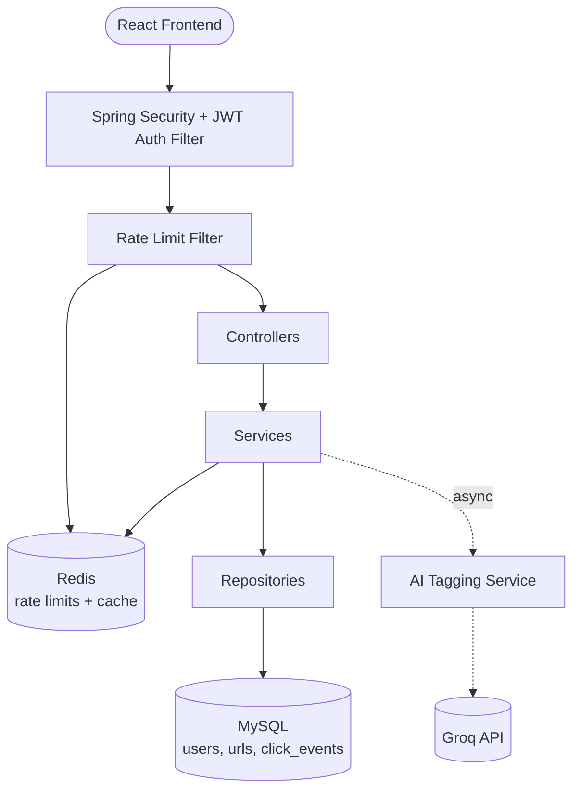

# 🔗 URL Shortener — Full-Stack Spring Boot + React

A URL shortening service built with Spring Boot and React, featuring Redis caching, JWT authentication, rate limiting, AI-powered categorization, and Docker containerization with CI.


---

## 📋 Table of Contents

- [Overview](#overview)
- [Project Structure](#project-structure)
- [Features](#features)
- [Tech Stack](#tech-stack)
- [Architecture](#architecture)
- [Getting Started](#getting-started)
- [API Reference](#api-reference)
- [Key Design Decisions](#key-design-decisions)
- [Running Tests](#running-tests)
- [What's Next](#whats-next)

---

## Overview

This project focuses on real backend engineering concerns: cache-aside caching with graceful degradation, race-condition-safe click counting, stateless authentication, async processing, and CI automation, wrapped in a working React UI so the whole system can be demoed live, not just tested with curl. The trade-offs behind each feature are documented in [Key Design Decisions](#key-design-decisions).

## Project Structure

This is a monorepo containing both the backend API and a React frontend:

```
url-shortener/
├── src/                        # Spring Boot backend
├── url-shortener-frontend/     # React + Vite frontend
├── pom.xml
├── docker-compose.yml
└── .env.example                # copy to .env before running
```

The frontend provides a full UI: register/login, create shortened URLs, and view your links with click counts and AI-generated categories.

## Features

| Feature | Description |
|---|---|
| 💻 **React Frontend** | Full UI for registration, login, and managing shortened URLs — not just an API |
| 🔗 **URL Shortening** | Random, unguessable 7-character Base62 codes (`SecureRandom`), with automatic retry on the rare collision |
| ⚡ **Redis Caching** | Cache-aside pattern with a 30-minute TTL on the redirect lookup path; if Redis is down, redirects fall back to MySQL |
| 🛡️ **Rate Limiting** | Per-IP fixed-window counter in Redis, incremented atomically with a Lua script; fails open if Redis is unavailable |
| 🔐 **JWT Authentication** | Registration, login, BCrypt password hashing, fully stateless token validation |
| 📊 **Atomic Click Tracking** | Race-condition-safe click counting via a single atomic SQL update |
| 🤖 **AI Auto-Categorization** | Async LLM call (Groq API) tags each URL with a category — never blocks the request path (off by default) |
| 🗄️ **Flyway Migrations** | Versioned database schema — no manual DDL |
| 🐳 **Dockerized backend** | Backend + MySQL + Redis run with Docker Compose (the frontend runs separately with `npm run dev`) |
| ✅ **CI Pipeline** | GitHub Actions runs the unit tests and builds the Docker image on every push |
| 🧪 **Unit Tested** | URL service logic and the Base62 encoder tested with JUnit 5 + Mockito |

## Tech Stack

- **Backend:** Java 21, Spring Boot 3.3, Spring Security, Spring Data JPA
- **Frontend:** React (Vite), React Router, Axios
- **Database:** MySQL 8, Flyway migrations
- **Caching / Rate Limiting:** Redis
- **Auth:** JWT (JJWT library), BCrypt
- **AI:** Groq API (GPT-OSS model) for async URL categorization
- **Testing:** JUnit 5, Mockito
- **DevOps:** Docker, Docker Compose, GitHub Actions

## Architecture


```mermaid
flowchart TD
    UI([React Frontend]) --> Sec[Spring Security + JWT Auth Filter]
    Sec --> RL[Rate Limit Filter]
    RL --> Redis1[(Redis<br/>rate limits + cache)]
    RL --> Ctrl[Controllers]
    Ctrl --> Svc[Services]
    Svc --> Redis1
    Svc --> Repo[Repositories]
    Repo --> MySQL[(MySQL<br/>users, urls, click_events)]
    Svc -.async.-> AI[AI Tagging Service]
    AI -.-> Groq[(Groq API)]
```

## Getting Started

### Prerequisites
- Docker & Docker Compose (recommended), **or** Java 21 + Maven + MySQL + Redis for local backend setup
- Node.js 20+ for the frontend

### Run the Backend with Docker

**1. Clone the repo and create your `.env` file** (Compose refuses to start without it):

```bash
git clone https://github.com/SathvikSolomonS/url-shortener.git
cd url-shortener
```

Then copy the template and fill in the values:

```bash
# Mac / Linux
cp .env.example .env

# Windows PowerShell
Copy-Item .env.example .env
```

At minimum, set `DB_ROOT_PASSWORD`, `DB_PASSWORD` and `JWT_SECRET` (at least 32 characters) in `.env`. See [Environment Variables](#environment-variables).

**2. Start everything:**

```bash
docker compose up --build
```

The API will be available at `http://localhost:8080`.

> **Changed a database password after the first run?** MySQL only creates its user on the first start of the volume. Reset it with `docker compose down -v` (this deletes local data), then `docker compose up --build` again.

### Running the Frontend

```bash
cd url-shortener-frontend
npm install
npm run dev
```

Visit `http://localhost:5173` — make sure the backend is running on port 8080 first.

### Environment Variables

Set these in `.env` (a template is in `.env.example`).

| Variable | Required | Purpose | Default |
|---|---|---|---|
| `DB_ROOT_PASSWORD` | Yes | MySQL root password | *(none — Compose fails without it)* |
| `DB_USER` | Yes | MySQL application user | *(none — Compose fails without it)* |
| `DB_PASSWORD` | Yes | MySQL application user's password | *(none — Compose fails without it)* |
| `JWT_SECRET` | Yes | Secret key for signing JWTs (min. 32 characters) | *(none — the app won't start without it)* |
| `BASE_URL` | No | Public base URL used to build short links | `http://localhost:8080` |
| `AI_TAGGING_ENABLED` | No | Toggle AI categorization on/off | `false` |
| `GROQ_API_KEY` | No | API key for AI categorization | *(empty — feature disabled without it)* |
| `FORWARD_HEADERS_STRATEGY` | No | Set to `native` only behind a trusted proxy so the real client IP is used for rate limiting | `none` |

## API Reference

**Register**
```bash
curl -X POST http://localhost:8080/api/auth/register \
  -H "Content-Type: application/json" \
  -d '{"username": "demo", "email": "demo@example.com", "password": "password123"}'
```

**Create a short URL** (use the token from registration)
```bash
curl -X POST http://localhost:8080/api/urls \
  -H "Content-Type: application/json" \
  -H "Authorization: Bearer <your-token>" \
  -d '{"originalUrl": "https://www.example.com"}'
```

**Use the short URL**
```bash
curl -I http://localhost:8080/<shortCode>
```

**Health check** (the only public actuator endpoint; `info` and `metrics` require a token)
```bash
curl http://localhost:8080/actuator/health
```

## Key Design Decisions

| Decision | Why |
|---|---|
| Random short codes instead of encoded auto-increment IDs | Sequential codes (`/1`, `/2`, …) let anyone enumerate every link; random codes are unguessable, and a unique constraint plus retry handles collisions |
| No placeholder row when creating a URL | Each URL is a single insert with its final code, so concurrent creations don't serialize on a shared placeholder value |
| Atomic click increment at the DB level | Avoids lost updates under concurrent clicks — no read-then-write race condition |
| Cache reads separated from click-tracking writes | Click counts always hit MySQL directly, keeping analytics accurate even with caching enabled |
| Redis failures never take the app down | A cache error handler treats Redis errors as cache misses, and the rate limiter fails open, so redirects keep working from MySQL |
| Rate limiter as a single Lua script | `INCR` and `EXPIRE` run atomically, so a crash can't leave a counter without an expiry |
| Restricted cache type validator | Only `com.urlshortener`, `java.util` and `java.time` classes can be deserialized from Redis |
| Stateless JWT auth (`SessionCreationPolicy.STATELESS`) | No server-side session storage — the app can scale horizontally without sticky sessions |
| AI tagging runs `@Async`, wrapped in try/catch | A slow or failed AI call never affects URL creation — the feature degrades gracefully |
| Multi-stage Docker build | Final image ships only the compiled JAR on a minimal JRE base, not the full Maven/JDK toolchain |
| CORS explicitly scoped to the frontend's origin | The API only accepts cross-origin requests from the known React dev server, not a wildcard |

## Running Tests

```bash
mvn test
```

## What's Next

Known gaps I plan to address:

- Integration tests with real MySQL and Redis (Testcontainers), including a concurrency test for click counts
- Record per-click analytics in the `click_events` table (the table exists but nothing writes to it yet)
- Buffer click counts in Redis instead of writing to MySQL on every redirect
- Negative caching for unknown short codes, and a cache-stampede guard
- Refresh tokens and token revocation
- Pagination for the "my links" endpoint

## Author

**Sathvik Solomon**
[GitHub](https://github.com/SathvikSolomonS) · [LinkedIn](https://linkedin.com/in/sathviksolomon)

## License

MIT